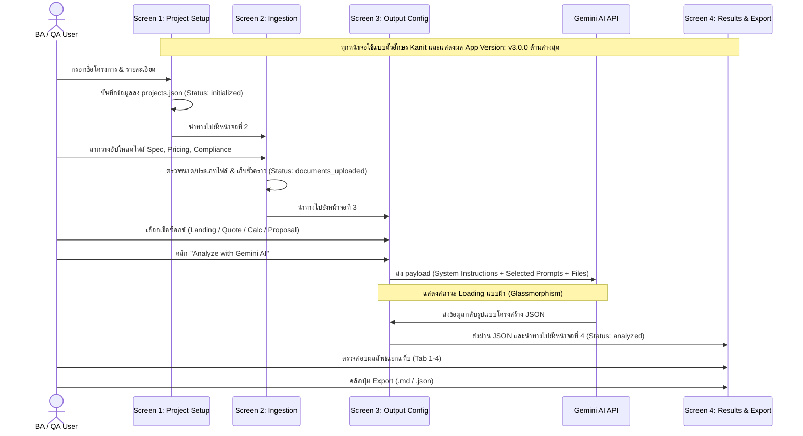

# Business Requirement Specification (BRS): Screen-Oriented Directory

**Project Name:** Insurance Requirement Extraction for Business Analyze (IREBA)  
**Target Product:** FutureShield 99  
**Document Version:** 3.0.0  
**Status:** Under Review  

ยินดีต้อนรับสู่สารบัญข้อกำหนดความต้องการทางธุรกิจ (Business Requirement Specification - BRS) ฉบับแบ่งตามหน้าจอการใช้งาน (Screen-Oriented) ของระบบ **IREBA** 

ระบบนี้เป็นเว็บแอปพลิเคชันต้นแบบที่ใช้ประมวลผลเอกสารข้อกำหนดประกันภัยโดยส่งผ่านไปยัง **Gemini API** ร่วมกับ **Prompt Templates** เพื่อสกัดข้อมูลและแปลงเป็นเอกสารข้อกำหนดทางซอฟต์แวร์ (Software Requirements) ในรูปแบบ JSON เพื่อส่งต่อให้ทีมพัฒนาซอฟต์แวร์ (SE) และฝ่ายตรวจสอบคุณภาพ (QA) ไปดำเนินการพัฒนาและทดสอบตามหน้าที่ของหน้าจอ 1 ถึง 4

---

## 1. Directory Structure (โครงสร้างเอกสาร BRS)

* **[README.md](file:///d:/development/IRIS-Training/IRIS-Prototype/Requirements/business-requirements/README.md) (เอกสารนี้)**: สารบัญและตารางตรวจสอบย้อนกลับความต้องการ (Traceability Matrix)
* **[BRS-UX-CSS-Design-System.md](file:///d:/development/IRIS-Training/IRIS-Prototype/Requirements/business-requirements/BRS-UX-CSS-Design-System.md)**: สเปกข้อกำหนด UI/UX ฟอนต์ Kanit, CSS variables, และระบบ App Version Popup
* **[BRS-01-Screen-1-Project-Initialization.md](file:///d:/development/IRIS-Training/IRIS-Prototype/Requirements/business-requirements/BRS-01-Screen-1-Project-Initialization.md)**: รายละเอียดหน้าจอที่ 1 - การสร้างโครงการและการจำลองฐานข้อมูล (`projects.json`)
* **[BRS-02-Screen-2-Document-Ingestion.md](file:///d:/development/IRIS-Training/IRIS-Prototype/Requirements/business-requirements/BRS-02-Screen-2-Document-Ingestion.md)**: รายละเอียดหน้าจอที่ 2 - การนำเข้าอัปโหลดไฟล์ การกลั่นกรองและจัดเก็บลง Cache ชั่วคราว
* **[BRS-03-Screen-3-Output-Configuration-AI-Prompting.md](file:///d:/development/IRIS-Training/IRIS-Prototype/Requirements/business-requirements/BRS-03-Screen-3-Output-Configuration-AI-Prompting.md)**: รายละเอียดหน้าจอที่ 3 - การตั้งรูปแบบผลลัพธ์เพื่อสร้าง Prompt และส่งคำขอผ่าน Gemini API
  * **Sub-req 3.1:** Landing Page AI Prompt Template
  * **Sub-req 3.2:** Quick Quote Validation AI Prompt Template
  * **Sub-req 3.3:** Product Calculation Engine AI Prompt Template
  * **Sub-req 3.4:** Sale Proposal & Compliance AI Prompt Template
* **[BRS-04-Screen-4-Result-Display-Export.md](file:///d:/development/IRIS-Training/IRIS-Prototype/Requirements/business-requirements/BRS-04-Screen-4-Result-Display-Export.md)**: รายละเอียดหน้าจอที่ 4 - การเรนเดอร์ข้อมูลสเปกที่สกัดได้แบบแยกแท็บ ตารางคำนวณคณิตศาสตร์ประกันภัย และเมนูส่งออกไฟล์รายงาน (`.md` / `.json`)
  * **Sub-req 4.1:** Landing Page Output Schema
  * **Sub-req 4.2:** Quick Quote Form Validation Schema
  * **Sub-req 4.3:** Product Calculation QA Math Matrix & Schema
  * **Sub-req 4.4:** Sale Proposal cash value projection formulas, Tax logic, Compliance Disclaimer & Schema
  * **Sub-req 4.5:** Export MD/JSON Payloads Specifications

---

## 2. Requirement Traceability Matrix (ตารางตรวจสอบย้อนกลับ)

| Req Code | Topic Name (หัวข้อความต้องการ) | UI Screen Location | Target BRS Document | Target Section |
| :--- | :--- | :---: | :--- | :--- |
| **`REQ-LP-001`** | Product Name | Screen 4 | [BRS-04-Screen-4-Result-Display-Export.md](file:///d:/development/IRIS-Training/IRIS-Prototype/Requirements/business-requirements/BRS-04-Screen-4-Result-Display-Export.md) | Sub-req 4.1 / Tab 1 Display |
| **`REQ-LP-002`** | Tagline | Screen 4 | [BRS-04-Screen-4-Result-Display-Export.md](file:///d:/development/IRIS-Training/IRIS-Prototype/Requirements/business-requirements/BRS-04-Screen-4-Result-Display-Export.md) | Sub-req 4.1 / Tab 1 Display |
| **`REQ-LP-003`** | Key Benefits | Screen 4 | [BRS-04-Screen-4-Result-Display-Export.md](file:///d:/development/IRIS-Training/IRIS-Prototype/Requirements/business-requirements/BRS-04-Screen-4-Result-Display-Export.md) | Sub-req 4.1 / Tab 1 Display |
| **`REQ-QQ-001`** | Input: Age Validation | Screen 4 | [BRS-04-Screen-4-Result-Display-Export.md](file:///d:/development/IRIS-Training/IRIS-Prototype/Requirements/business-requirements/BRS-04-Screen-4-Result-Display-Export.md) | Sub-req 4.2 / Tab 2 Display |
| **`REQ-QQ-002`** | Input: Sum Assured Validation | Screen 4 | [BRS-04-Screen-4-Result-Display-Export.md](file:///d:/development/IRIS-Training/IRIS-Prototype/Requirements/business-requirements/BRS-04-Screen-4-Result-Display-Export.md) | Sub-req 4.2 / Tab 2 Display |
| **`REQ-QQ-003`** | Input: Premium Payment Term | Screen 4 | [BRS-04-Screen-4-Result-Display-Export.md](file:///d:/development/IRIS-Training/IRIS-Prototype/Requirements/business-requirements/BRS-04-Screen-4-Result-Display-Export.md) | Sub-req 4.2 / Tab 2 Display |
| **`REQ-CAL-001`**| Base Premium Calculation | Screen 4 | [BRS-04-Screen-4-Result-Display-Export.md](file:///d:/development/IRIS-Training/IRIS-Prototype/Requirements/business-requirements/BRS-04-Screen-4-Result-Display-Export.md) | Sub-req 4.3 / Tab 3 Display |
| **`REQ-CAL-002`**| Volume Discount Calculation | Screen 4 | [BRS-04-Screen-4-Result-Display-Export.md](file:///d:/development/IRIS-Training/IRIS-Prototype/Requirements/business-requirements/BRS-04-Screen-4-Result-Display-Export.md) | Sub-req 4.3 / Tab 3 Display |
| **`REQ-CAL-003`**| Total Net Premium Calculation | Screen 4 | [BRS-04-Screen-4-Result-Display-Export.md](file:///d:/development/IRIS-Training/IRIS-Prototype/Requirements/business-requirements/BRS-04-Screen-4-Result-Display-Export.md) | Sub-req 4.3 / Tab 3 Display |
| **`REQ-SP-001`** | Benefit Table (CV Projection) | Screen 4 | [BRS-04-Screen-4-Result-Display-Export.md](file:///d:/development/IRIS-Training/IRIS-Prototype/Requirements/business-requirements/BRS-04-Screen-4-Result-Display-Export.md) | Sub-req 4.4 / Tab 4 Display |
| **`REQ-SP-002`** | Tax Benefit Logic | Screen 4 | [BRS-04-Screen-4-Result-Display-Export.md](file:///d:/development/IRIS-Training/IRIS-Prototype/Requirements/business-requirements/BRS-04-Screen-4-Result-Display-Export.md) | Sub-req 4.4 / Tab 4 Display |
| **`REQ-SP-003`** | Disclaimer & Compliance Statement | Screen 4 | [BRS-04-Screen-4-Result-Display-Export.md](file:///d:/development/IRIS-Training/IRIS-Prototype/Requirements/business-requirements/BRS-04-Screen-4-Result-Display-Export.md) | Sub-req 4.4 / Tab 4 Display |

---

## 3. Screen Sequence Process Flow (ขั้นตอนการทำงานหลักของระบบ)

