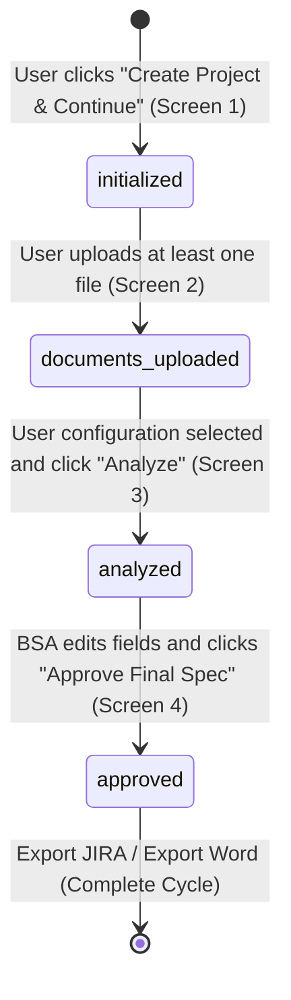

# IREBA: Software Developer Implementation Plans

**Project Name:** Insurance Requirement Extraction for Business Analyze (IREBA)  
**Target Architecture:** Node.js Backend / Vite Frontend (Deployable on Local & Vercel)  
**AI Engine:** Gemini API (`gemini-1.5-pro` or `gemini-1.5-flash`)  
**Data Storage:** Local or Vercel Ephemeral flat-file JSON (`projects.json`)  
**Document Version:** 1.0.0  

ยินดีต้อนรับสู่คู่มือการดำเนินงานพัฒนาซอฟต์แวร์ (Implementation Plans) ของระบบ **IREBA** 

เอกสารชุดนี้จัดทำขึ้นสำหรับวิศวกรซอฟต์แวร์ (Software Engineers - SE) เพื่อใช้อ้างอิงการจัดลำดับการเขียนโปรแกรมและการแบ่งส่วนงานเป็นหัวข้อย่อยย่อยตามรายหน้าจอและการเชื่อมโยง API โดยแบ่งหัวข้อตามลำดับความสำคัญก่อน-หลัง (Prioritized Sequence) เพื่อให้ง่ายต่อการเริ่มเขียนโค้ดและส่งมอบการตรวจสอบ

---

## 1. Directory Structure (สารบัญแผนการพัฒนาแยกรายส่วนงาน)

ทีมนักพัฒนาสามารถหยิบจับสเปกการพัฒนาแยกทำงานทีละหน้าได้โดยตรงตามเอกสารเหล่านี้:

* **[README.md](file:///d:/development/IRIS-Training/IRIS-Prototype/Requirements/implementation-plans/README.md) (เอกสารนี้)**: สรุปภาพรวม ลำดับความสำคัญ และกระบวนการร้อยเรียงส่วนงานทั้งหมด
* **[Section-01-Environment-Data-Storage-DAL.md](file:///d:/development/IRIS-Training/IRIS-Prototype/Requirements/implementation-plans/Section-01-Environment-Data-Storage-DAL.md)**: `[Priority: P0]` ข้อกำหนดและแม่แบบไฟล์ `.env`, ระบบสลับเส้นทาง Local/Vercel `/tmp` และตัวอย่างโค้ด DAL อ่านเขียนไฟล์ JSON
* **[Section-02-Screen-1-Project-Initialization.md](file:///d:/development/IRIS-Training/IRIS-Prototype/Requirements/implementation-plans/Section-02-Screen-1-Project-Initialization.md)**: `[Priority: P1]` การสร้างหน้าจอจัดตั้งโครงการ, การเช็คอินพุตฟิลด์เบื้องต้น, โค้ดสร้าง Project ID และสลักสถานะ `"initialized"`
* **[Section-03-Screen-2-Document-Ingestion.md](file:///d:/development/IRIS-Training/IRIS-Prototype/Requirements/implementation-plans/Section-03-Screen-2-Document-Ingestion.md)**: `[Priority: P2]` การสร้างระบบลากวางอัปโหลดไฟล์ การกรองความปลอดภัย (ประเภทไฟล์และขนาด 10 MB), ระบบจัดเก็บ Cache ชั่วคราว และอัปเดตสถานะ `"documents_uploaded"`
* **[Section-04-Screen-3-Gemini-AI-Engine.md](file:///d:/development/IRIS-Training/IRIS-Prototype/Requirements/implementation-plans/Section-04-Screen-3-Gemini-AI-Engine.md)**: `[Priority: P3]` ระบบ API Payload การเรียกใช้งานโมเดล Gemini API, ฟังก์ชันตรวจสภาพการเชื่อมต่อ (Gemini Connection Healthcheck) และกลไกการป้อนข้อมูลสถานะการวิเคราะห์อย่างละเอียด (Waiting Detail status text)
* **[Section-05-Screen-4-BSA-Editor-Approval.md](file:///d:/development/IRIS-Training/IRIS-Prototype/Requirements/implementation-plans/Section-05-Screen-4-BSA-Editor-Approval.md)**: `[Priority: P4]` ระบบแสดงผลข้อมูลแยกแท็บแบบ Clean UI การสร้างฟิลด์ให้ BSA เข้าแก้ไขรายละเอียด (Inline Edit) และระบบคลิกอนุมัติเปลี่ยนสถานะเป็น `"approved"` (Final)
* **[Section-06-Word-JIRA-Export-Engine.md](file:///d:/development/IRIS-Training/IRIS-Prototype/Requirements/implementation-plans/Section-06-Word-JIRA-Export-Engine.md)**: `[Priority: P5]` ระบบส่งออกข้อมูลสเปกเป็นไฟล์ Word (.docx) และชุดคำสั่งประมวลผลแปลง JSON เป็น CSV สำหรับอัปโหลดขึ้น JIRA

---

## 2. Project State Machine Diagram (ลอจิกสถานะและการเปลี่ยนผ่านข้อมูล)

ตัวแปรสถานะโครงการ (`status`) ในไฟล์ฐานข้อมูลจำลอง `projects.json` จะได้รับการเปลี่ยนค่าตามการกระทำของผู้ใช้ในแต่ละหน้าจอการทำงานหลักดังแผนผังลำดับขั้นต่อไปนี้:

---

## 3. Global CSS Layout & Typography Guide

ทีมนักพัฒนาซอฟต์แวร์ทุกคนต้องนำชุดสไตล์การจัดวางและฟอนต์ `Kanit` จากเอกสารสเปกหลักของระบบ [BRS-UX-CSS-Design-System.md](file:///d:/development/IRIS-Training/IRIS-Prototype/Requirements/business-requirements/BRS-UX-CSS-Design-System.md) มาประยุกต์ใช้ในการเขียน CSS ร่วมของทุกหน้าจอ เพื่อให้ได้ส่วนต่อประสานที่ดูสะอาดตา มอบความเป็นมิตรต่อผู้ใช้งาน และมีความเป็นมืออาชีพเป็นสากลเดียวกัน
