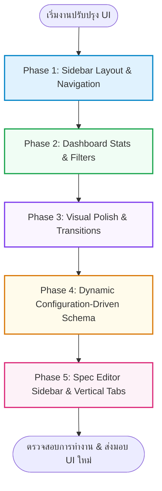

# แผนงานปรับปรุงอินเทอร์เฟซผู้ใช้ระบบ IREBA (UI/UX Refactoring Roadmap)

เอกสารฉบับนี้เป็นแผนงานหลัก (Master Plan) ในการปรับปรุงสถาปัตยกรรมอินเทอร์เฟซผู้ใช้ (UI/UX) ของระบบ **IREBA (v3.0.0)** เพื่อเปลี่ยนผ่านระบบจากรูปแบบขั้นตอนทีละสเต็ปแบบชั่วคราว (Wizard Card Layout) ไปสู่ **ระบบพื้นที่ทำงานแถบนำทางด้านข้างที่เป็นมืออาชีพ (Enterprise Sidebar Workspace)** 

การดำเนินการจะถูกแบ่งออกเป็น **4 ขั้นตอนหลัก (4 Phases)** เพื่อลดความซ้ำซ้อนของการแก้ไขโค้ด ป้องกันผลกระทบต่อหน้าจอด้านฟังก์ชันการสกัดข้อมูลเดิม และช่วยให้การทดสอบประสิทธิภาพการทำงานมีความเรียบร้อยทีละขั้นตอน

---

## 🗺️ แผนภาพรวมการแบ่งขั้นตอนการดำเนินการ (Implementation Phasing)

---

## 📋 สรุปสาระสำคัญของแต่ละขั้นตอน

งานจะถูกควบคุมแยกย่อยออกเป็นแผนปฏิบัติการตามลำดับ เพื่อหลีกเลี่ยงการแก้ไขจุดทับซ้อนและจัดหมวดหมู่โค้ดให้สอดรับกัน:

### 1. [Phase 1: โครงสร้าง Sidebar Layout และ Navigation](file:///d:/development/IRIS-Training/IRIS-Prototype/Requirements/ui-implementation-plans/phase-1-sidebar-layout.md)
* **เป้าหมายหลัก**: ปรับเปลี่ยน HTML/CSS ให้เป็น Layout สองคอลัมน์ (Sidebar ด้านซ้าย + พื้นที่ทำงานด้านขวา)
* **การเปลี่ยนแปลง**: ปรับโครงสร้าง Sidebar ด้านซ้ายและนำทางดึงข้อมูลใน Breadcrumbs แทน Stepper ตัวเลขเดิม

### 2. [Phase 2: ยกระดับหน้า Dashboard และฟังก์ชันกรองข้อมูล](file:///d:/development/IRIS-Training/IRIS-Prototype/Requirements/ui-implementation-plans/phase-2-dashboard-enhancements.md)
* **เป้าหมายหลัก**: เพิ่มความน่าเชื่อถือด้วยกล่อง Stats Cards สรุปข้อมูลภาพรวมโครงการ พร้อมเพิ่มช่องค้นหา ค้นกรอง และอวตารชื่อย่อโครงการ

### 3. [Phase 3: เอฟเฟกต์การสลับหน้าและ Visual Refinements](file:///d:/development/IRIS-Training/IRIS-Prototype/Requirements/ui-implementation-plans/phase-3-visual-refinements.md)
* **เป้าหมายหลัก**: เพิ่มความสวยพรีเมียม (WOW Factor) ด้วย CSS Page transitions, ปรับแต่ง Dropzone ให้ลอยกระโดด และอัปเกรดหน้าตา Loading AI เป็นกระจกฝ้า

### 4. [Phase 4: ระบบวิเคราะห์และแสดงผลแบบกำหนดโครงสร้างผ่านการตั้งค่า (Dynamic Configuration-Driven Schema)](file:///d:/development/IRIS-Training/IRIS-Prototype/Requirements/ui-implementation-plans/phase-4-dynamic-configuration.md)
* **เป้าหมายหลัก**: เพิ่มขีดความสามารถการสกัดข้อมูลให้ยืดหยุ่นสูง รองรับรายละเอียดสเปกที่เพิ่มมากขึ้นเรื่อยๆ (เช่น ข้อมูลการชำระเงิน Payment Terms, สัญญาเพิ่มเติมที่รองรับ Riders) โดยไม่ต้องเขียนโค้ดเพิ่มหน้าจอกลางใหม่
* **การเปลี่ยนแปลงที่สำคัญ**:
  * สร้างไฟล์ตั้งค่าโครงสร้าง [extraction-schema.json](file:///d:/development/IRIS-Training/IRIS-Prototype/data/extraction-schema.json) เก็บหัวข้อ Prompts และประเภทข้อมูลของแต่ละฟิลด์
  * ปรับแต่งหลังบ้านให้ส่งวิเคราะห์ AI ตาม JSON Schema ที่เปลี่ยนแปลงได้
  * พัฒนาหน้าแรก Screen 3 ให้วาดการ์ดเลือกหัวข้อตามไฟล์ตั้งค่า
  * พัฒนาหน้า Screen 4 ให้สร้างแท็บคอลัมน์ ตารางแก้ไข (Contenteditable) และสัญลักษณ์การจัดการแบบ Dynamic Rendering ทั้งหมด

### 5. [Phase 5: การปรับปรุงแผงตรวจสอบสเปกด้วยแถบนำทางแนวตั้ง (Vertical Spec Editor Sidebar)](file:///d:/development/IRIS-Training/IRIS-Prototype/Requirements/ui-implementation-plans/phase-5-spec-editor-sidebar.md)
* **เป้าหมายหลัก**: เปลี่ยนรูปแบบการแสดงผลของ Screen 4 จากแท็บแนวนอนด้านบนไปเป็นแถบเมนูนำทางแนวตั้งด้านซ้าย (Vertical Sidebar) เพื่อการเปลี่ยนหัวข้อที่ดูเป็นระเบียบ เรียบลื่น และเป็นมืออาชีพมากขึ้น

---

## 🚀 ลำดับการดำเนินการและการตรวจสอบ
การปรับปรุงจะไล่ทำตาม **Phase 1 -> 2 -> 3 -> 4 -> 5** เพื่อปรับปรุงส่วนควบคุมของระบบและส่วนจัดการสเปกข้อกำหนดความต้องการด้านประกันภัยให้เข้าสู่สถาปัตยกรรม Workspace ยุคใหม่อย่างสมบูรณ์แบบ

